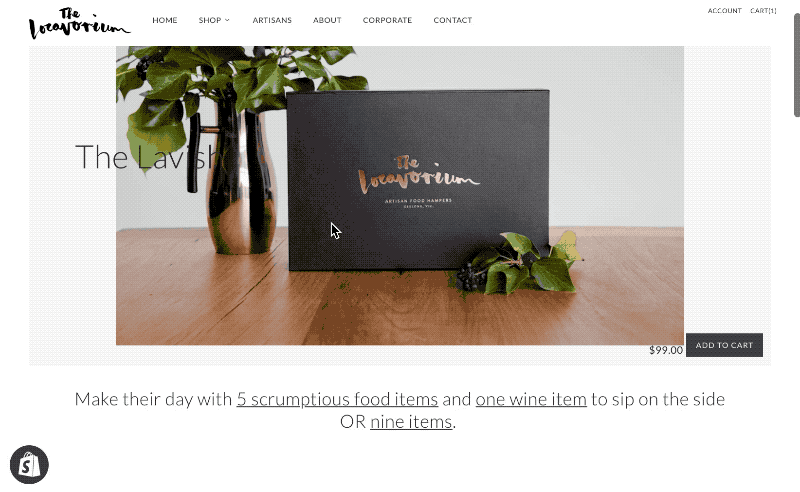

# Shopify Hamper - Theme Functionality

Extend functionality of a single product through the page template. Allowing customers to select from multiple items to build a custom hamper.

In action at https://thelocavorium.com.au/collections/pick-your-pack

##### Admin - Product Page

Hamper items are uploaded as images through the product admin page. With a file naming structure (xxxxcategoryxxxxitemnamexxxx.jpg).

##### Product Template

The items are compiled on page load from the product images. Each image file name is processed:

<u>category</u>is added as a class to be later targeted when filtering for selection limitations

<u>itemname</u>as is use as the title

Selection limits are hardcoded into the templates, some have simple quantity limits, others require a hamper combination to be selected that limit categories and quantities.

Selections are stored in a hidden input and sent with form submission.

###### Todo

* [ ] refactor javascript

15.11 - fixed limits on templates custom 6 and 7